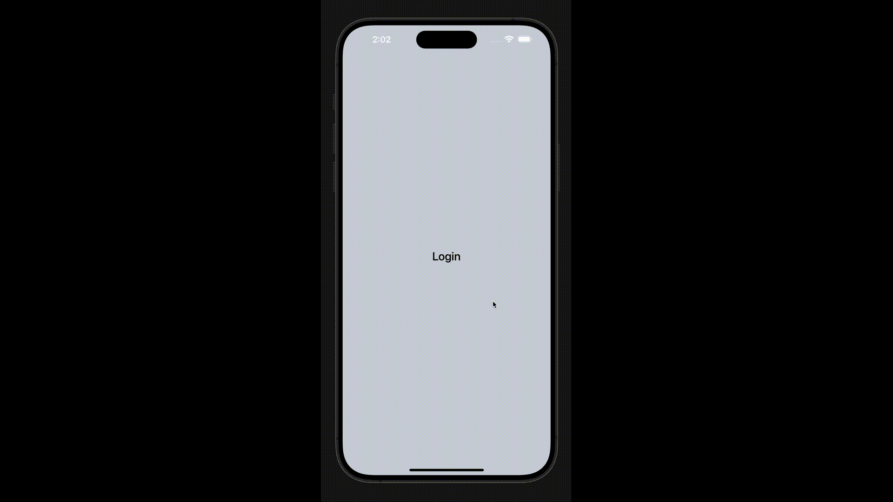

# React Native Bottom Sheet Modal Snippet with Backdrop Animation

A React Native snippet showcasing a bottom sheet modal with a backdrop animation. This template uses an example of an authentication form to demonstrate how to implement a bottom sheet with backdrop effects. It serves as a starting point for adding your own business logic.



## Features

- **Bottom Sheet Modal**: A modal component that slides up from the bottom of the screen.
- **Backdrop Animation**: Animated backdrop that fades in and out when the modal is opened or closed.
- **Example Authentication Form**: Includes text inputs for username and password, styled for demonstration purposes.

## Installation

To integrate this snippet into your project, follow these steps:

1. Clone the repository:

   ```bash
   git clone https://github.com/iCodeCraft/react-native-bottom-sheet-backdrop-snippet.git
   ```

2. Navigate to the project directory:

   ```bash
   cd react-native-bottom-sheet-backdrop-snippet
   ```

3. Install additional required packages:

   ```bash
   npm install react-native-reanimated @gorhom/bottom-sheet
   ```

## Usage

1. Import the `Login` component from the snippet into your application:

   ```javascript
   import Login from './path-to-Login';
   ```

2. Use the `Login` component in your app:

   ```javascript
   import React from 'react';
   import { SafeAreaView, StyleSheet } from 'react-native';
   import Login from './path-to-Login';

   const App = () => {
     return (
       <SafeAreaView style={styles.container}>
         <Login />
       </SafeAreaView>
     );
   };

   const styles = StyleSheet.create({
     container: {
       flex: 1,
     },
   });

   export default App;
   ```

## Code Overview

- **Backdrop Animation**: Utilizes `react-native-reanimated` for smooth backdrop transitions.
- **Bottom Sheet**: Uses `@gorhom/bottom-sheet` to create a modal with snap points.
- **Authentication Form**: Demonstrates input fields and button styling, without implementing actual authentication logic.

## Customization

Feel free to customize the modal and backdrop styles, as well as the form fields, according to your application's requirements. Replace the example form with your own content or logic as needed.

## Contributing

Contributions are welcome! If you have suggestions for improvements or bug fixes, please open an issue or submit a pull request.

## License

This project is licensed under the MIT License - see the [LICENSE](LICENSE) file for details.
